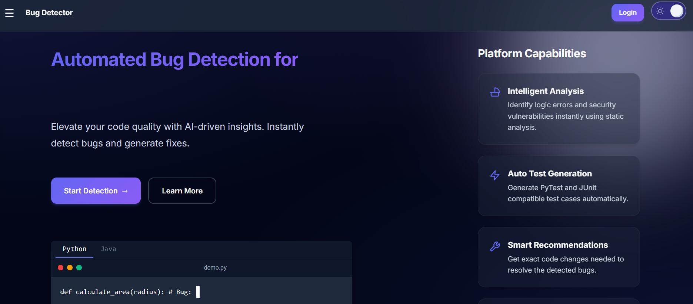

#  Bug Detector – Frontend Interface

A modern and responsive frontend interface for a code analysis platform.  
This project demonstrates a professional UI for a bug detection system, including authentication flow, code upload interface, and results display layout.

---

## ✨ Features
- Modern dark-themed UI  
- Login and Signup pages  
- Code upload interface  
- Structured results display layout  
- Clean and responsive design  

---

## 🛠 Tech Stack
- HTML  
- CSS  
- JS
- Flask Templates  

---

## 📌 Note
This repository contains only the frontend interface. Backend logic and detection systems are separate.
